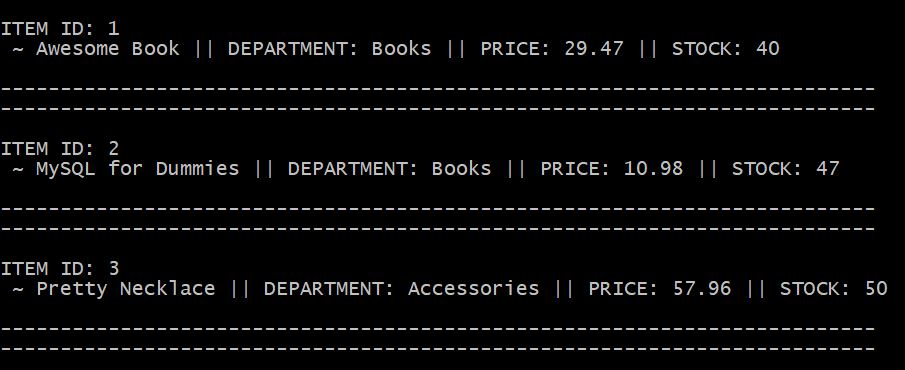
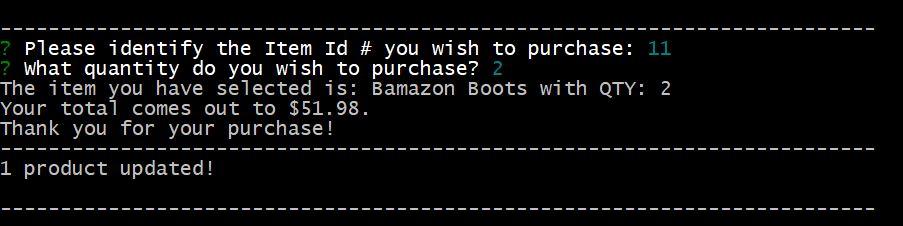
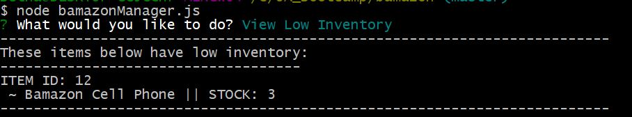
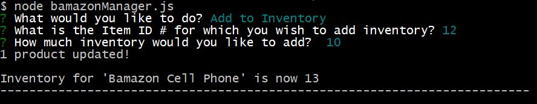
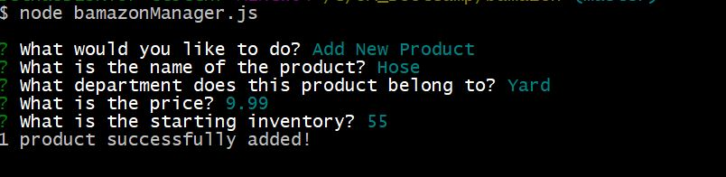
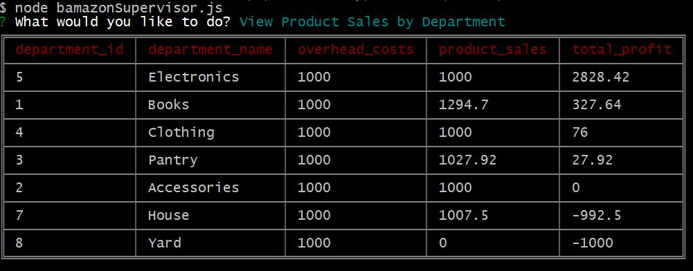
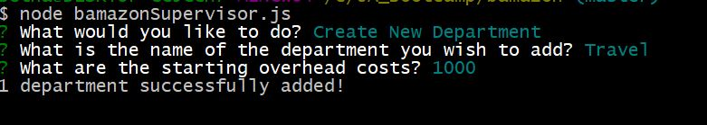

# bamazon

## Overview

Bamazon is an Amazon-like storefront using MySQL as database. The app uses Node.js to take in orders from customers and deplete stock from the store's inventory. Users with a Manager or Supervisor role can update inventory, products, and departments in the database directly from the app. The app can also track product sales across the store's departments and provide a summary of the highest-grossing departments in the store.

### Requirements

The app is run on Node.js and requires that this be installed on your computer.  You will also need to install a few node packages. All the details for the required node packages are stored in the package.json file. Use the CLI and type in the code below to install them.

```
npm install
```

### Customer View

Running the bamazonCustomer.js file will give you the Customer view, which allows you to view all inventory in the database and make a selection for purchase. Stock and product sales will be automatically updated once a purchase is made.





### Manager View

Running the bamazonManager.js file will give you the Manager view, which includes 4 options:

* View Products for Sale


* View Low Inventory



* Add to Inventory



* Add New Product



### Supervisor View

Running the bamazonSupervisor.js file will give you the Supervisor view, which includes 2 options:

* View Product Sales by Department



* Create New Department



### Video demo

* [bamazon demo](https://youtu.be/eaR5EYskFbk)

## Authors

* **Bethany Pfeister** 

## Acknowledgments

* UA Programming Bootcamp
